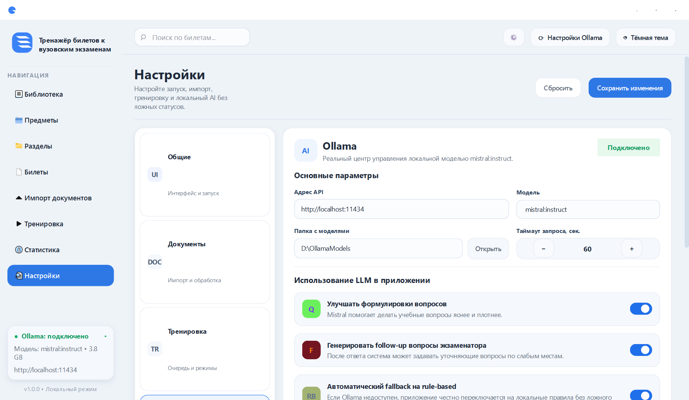
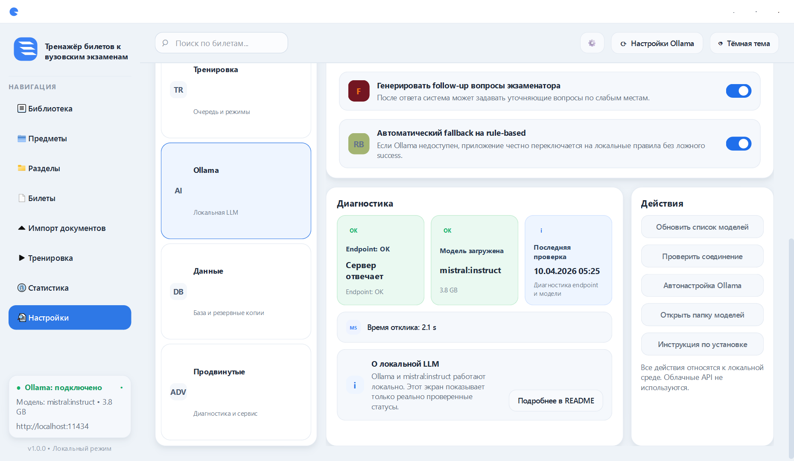
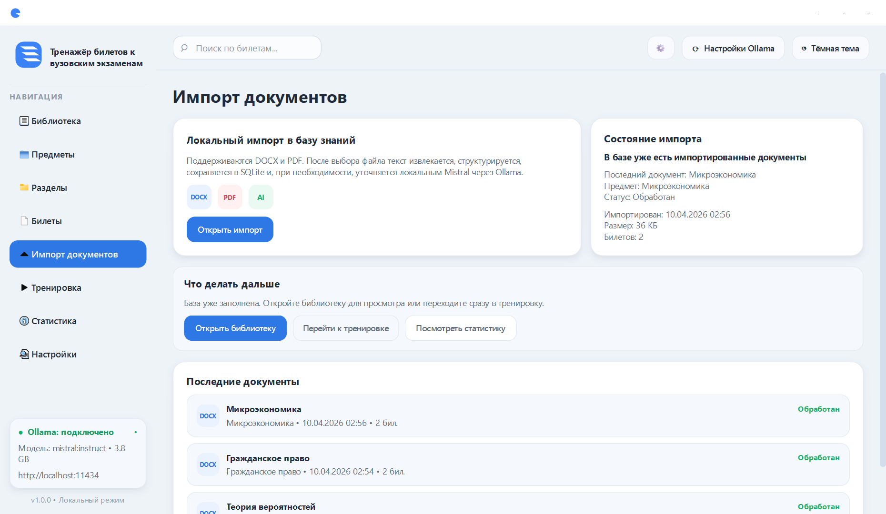
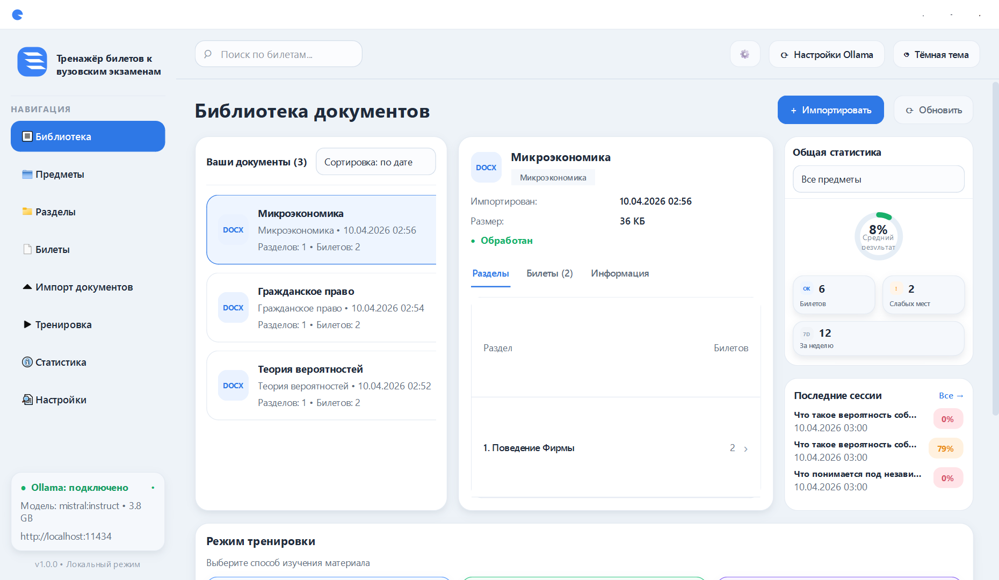
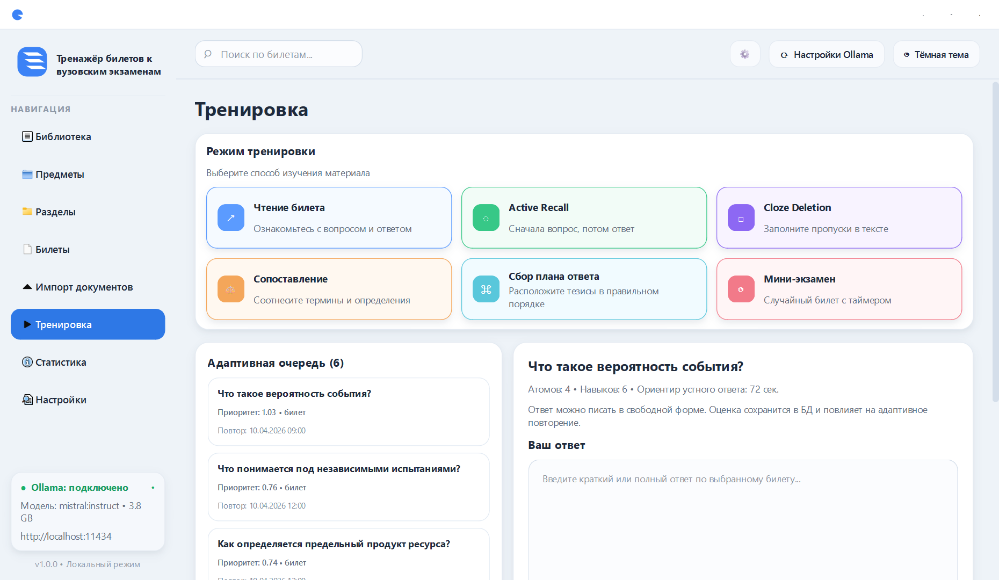
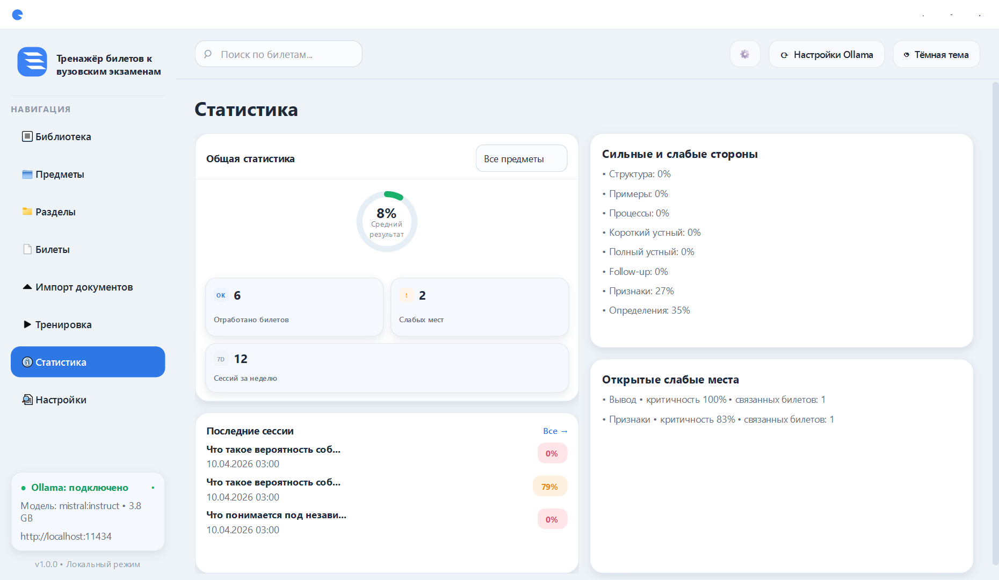
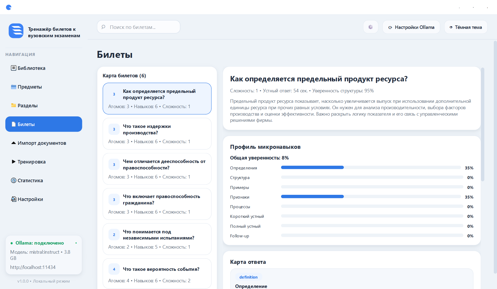

# Подробное руководство пользователя

Это руководство рассчитано на человека, который получил приложение уже собранным и не хочет разбираться в исходниках. Если нужен запуск из исходников, сначала установите `Python 3.12+` и зависимости из `requirements.txt`.

## Экран 1. Настройка локального ИИ

Откройте `Настройки -> Ollama`.



Нижняя зона этого же экрана показывает реальную диагностику и сервисные действия.



Что означает экран:
- `Адрес API` это локальный endpoint Ollama
- `Модель` это preferred-модель, с которой работает приложение
- `Папка с моделями` это каталог для локальных весов
- `Диагностика` показывает реальное состояние, а не декоративный статус

Что делать:
1. Нажмите `Проверить соединение`.
2. Если Ollama не готов, нажмите `Автонастройка Ollama`.
3. После завершения снова нажмите `Проверить соединение`.
4. При необходимости нажмите `Обновить список моделей`.

Как понять, что экран в порядке:
- в правом верхнем углу блока виден зелёный статус
- `Endpoint` показывает успешную проверку
- `Модель` показывает `qwen3:8b` или совместимую локальную `Qwen`-модель
- `Время отклика` не пустое

Другие внутренние разделы настроек тоже рабочие:
- `Общие` для темы, стартового экрана и поведения первого запуска
- `Документы` для папки импорта и предпочтительного формата
- `Тренировка` для режима по умолчанию, профиля повторения и размера очереди
- `Данные` для путей и резервной копии SQLite
- `Продвинутые` для audit/docs, check script и проверки обновлений

## Экран 2. Импорт документов

Откройте `Импорт документов`.



Главный сценарий релиза:
- импорт одного большого `DOCX`

Поддерживаемый второй сценарий:
- `PDF`

Что произойдёт после выбора файла:
1. текст извлечётся
2. приложение попытается найти разделы и билеты
3. построит карту знаний
4. сохранит результат в базу
5. покажет summary и что делать дальше

Что смотреть в summary:
- имя документа
- число созданных билетов
- число разделов
- warning
- `LLM assist: да/нет`

Что важно оговаривать заранее:
- отдельного `import preview` перед запуском импорта сейчас нет
- приложение должно оставаться отзывчивым и показывать stage-based progress
- warnings не скрывают проблему и показывают, что часть структуры была слабой

## Экран 3. Библиотека

После импорта откройте `Библиотеку`.



Что тут важно:
- слева список документов
- по центру детали выбранного документа
- справа общая статистика
- снизу быстрый вход в training modes

Если локальный ИИ ещё не готов или билеты ещё не загружены, в верхней части экрана появляется onboarding-блок с понятным следующим шагом.

## Экран 4. Тренировка

Откройте `Тренировку`.



Экран состоит из двух частей:
- слева адаптивная очередь
- справа текущая сессия ответа

В текущем UI доступны 7 отдельных режимов:
- `reading`
- `active-recall`
- `cloze`
- `matching`
- `plan`
- `mini-exam`
- `state-exam-full`

Как пройти минимальную сессию:
1. выберите билет из очереди
2. выберите режим тренировки
3. напишите ответ
4. нажмите `Проверить ответ`
5. прочитайте feedback
6. при наличии follow-up вопросов используйте их как следующее уточнение

Что важно понимать:
- у движка есть более широкая внутренняя taxonomy exercise types
- не все внутренние типы упражнений выведены как отдельные пользовательские режимы
- Windows beta path теперь подтверждён и menu-by-menu click-audit закрывает все 7 mode-specific сценариев без ложного `FAIL`

## Экран 5. Статистика

Откройте `Статистику`.



Там можно быстро понять:
- насколько вы готовы в среднем
- что проседает по навыкам
- какие weak areas уже обнаружены
- какие сессии были последними

Для билетов `Госэкзамен` доступен отдельный профиль готовности по answer blocks и критериям.

## Экран 6. Карта билета

Экран `Билеты` показывает внутреннюю структуру материала.



Зачем он нужен:
- увидеть не только сплошной текст, но и атомы знаний
- понять, какие части билета уже выделены
- посмотреть связи, навыки и шаблоны упражнений

## Типовой рабочий маршрут

Если нужно быстро начать готовиться:
1. проверить `Ollama`
2. импортировать большой `DOCX`
3. открыть `Библиотеку`
4. перейти в `Тренировку`
5. пройти 3-5 попыток
6. открыть `Статистику`
7. повторить цикл позже через adaptive queue

## Repo / Release Truth

Для обычного пользователя этот раздел не нужен, но он важен для тех, кто собирает релиз:
- редактируемый source-of-truth находится в корневых `README.md`, `docs`, `scripts`, коде и тестах
- `build` считается временным артефактом сборки
- `dist` считается финальным generated output
- packaged-копии `README/docs/scripts` внутри `dist/Tezis` не редактируются вручную

## DLC `Тезис`

В интерфейсе есть отдельный paywalled workspace `Защита DLC`.

Что в нём уже доступно:
- активация по ключу
- создание проекта защиты
- импорт материалов защиты
- dossier
- outline доклада
- storyboard слайдов
- вопросы комиссии
- mock defense с follow-up вопросами и разбором слабых мест

Что важно оговаривать заранее:
- это сильный локальный DLC-модуль с manual activation
- модуль требует локального `Ollama`
- без активации DLC остаётся закрытым
- оплата в приложении не встроена; используется manual activation code
- часть изначально задуманных defense workflow ещё не оформлена как отдельные пользовательские режимы

## Частые проблемы

### Статус есть, но ИИ по факту не работает

Смотрите не на цвет, а на факты:
- есть ли модель в диагностике
- есть ли время отклика
- проходит ли `scripts\check_ollama.ps1`

### Импорт прошёл, но билетов мало

Причины:
- в исходном документе слабая структура
- билеты плохо размечены
- часть материала ушла в fallback

Что делать:
- попробовать более чистый `DOCX`
- упростить нумерацию билетов в документе
- снова импортировать файл

### После проверки ответа нет полезного эффекта

Проверьте:
- действительно ли был выбран билет
- был ли непустой ответ
- изменилась ли статистика после проверки

## macOS

На macOS в репозитории подготовлены код, скрипты и инструкция. Финальный ручной runtime smoke-run должен выполняться на реальном Mac отдельно.

Практический путь:
1. сначала попробовать запуск из исходников через `python3 main.py`
2. затем при необходимости собрать `.app` через `bash scripts/build_mac_app.sh`
3. для локального Ollama использовать `bash scripts/setup_ollama_macos.sh` и `bash scripts/check_ollama_macos.sh`
4. для внешнего исполнителя использовать handoff checklist из `audit/mac_runtime_handoff.md`

Если macOS не даёт открыть unsigned app:

```bash
xattr -dr com.apple.quarantine dist/Tezis.app
```
